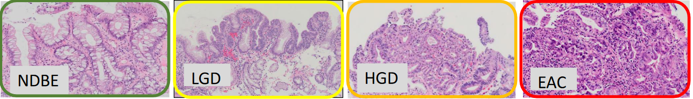

## BE expert-level gland grading with Neural Networks
This repository contains code for development of a Neural Network that identifies dysplastic areas of interest on H&E 
data tissue samples and BE biopsies to support pathologists in their diagnostic workflow. 

### The Task:
BE experts grade biopsies according to the Vienna Classification:

### Updates:
- [ ] Clean the data:
    * There is polygon annotations with <3 coordinates.
    * Gland annotations that include non tissue => mask out non tissue.
- [ ] Split data for training, evaluation and testing (keep Bolero apart for testing).
- [ ] Include extra classes: stroma, squamous epithelium, intestinal metaplasia (IM)  
- [ ] Acquire case or slide level annotations.

### (1) Segmentation pipeline for gland grading into: (NDBE, LGD, HGD)
* Networks architectures to consider: UNet, Hooknet, RAENet
* For on fly patch extraction we use: https://github.com/DIAGNijmegen/pathology-whole-slide-data
  * Includes configuration for patch extraction such as batch size, patch size, spacing.
  * Includes different strategies to sample patches from the WSI (balanced, random, slidingwindow).
  * Configuration stored in (`configs/unet_training_config.yml`)
* Evaluation with F1/Dice weighted and per class.

### (2) Data 
Below a summary is shown of all the data available for this project. Gland level annotations were provided by Sybren. 
Case or slide level annotations were not provided yet.

### Datasets
Relevant datasets on AMC servers (/data/archief/AMC-data/Barrett/):
* ASL
   * N patients: 36
   * prefix(es): “ASLxx_K_HE” (K is 3 or 1. difference?)
* Bolero
   * N patients: 51
   * prefix(es): “RB00xx_HE”
* LANS
   * N patients: 34
   * prefix(es): “RLxxx_0x_ox_ox_HE” (last three x can be 1-5; meaning?)
* LANS-Tissue
   * N patients: 42
   * prefix(es): “RLxxx_0x_ox_ox_HE” (last three x can be 1-7; meaning?)
   * Note: What is the meaning of tissue level annotations that overlap with gland level annotations?
     Everything outside of the gland level annotations belongs to the tissue level annotation label?
* RBE
   * N patients: 187
   * prefix(es): “RBE-00xxx_HE”, “RBET17-xxxxx_HE_r”, “RBET18-xxxxx_HE-r_BIG”  “ROCTxx_r-HEx” (last x is number). r is Roman Numeral
   * Note: Missing xml P53 staining for “RBE-00121_P53.tiff”, “RBE-00123_P53.tiff”, “RBE-00124_P53.tiff”
* RBE_Nieuw
   * N patients: 25
   * prefix(es): “RBE-00xxx_HE”

Datasets to exclude:
* Maastricht- OLD_DATA
   * DO NOT INCLUDE
* temp:
   * DO NOT INCLUDE: Seems to be subset of RBE

### Results
To be added...