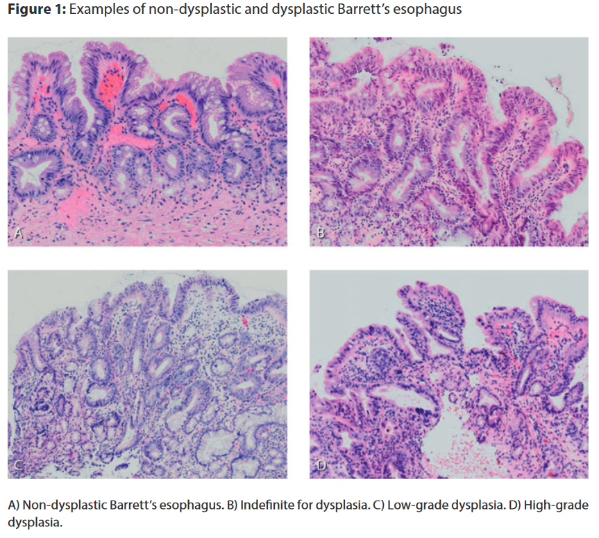
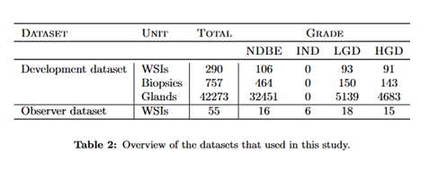
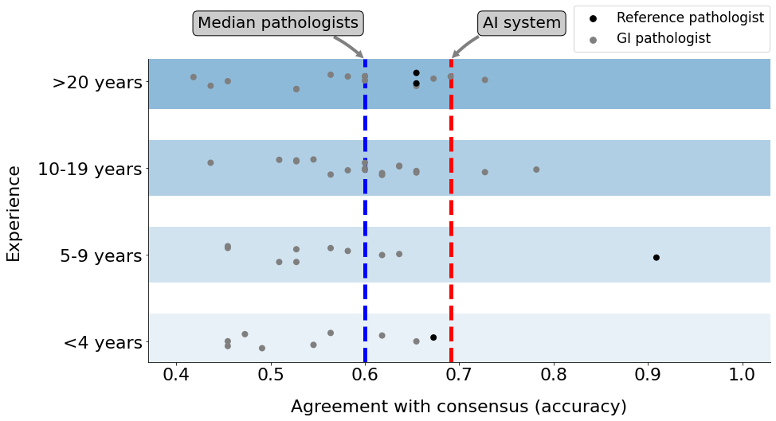

 ## BE expert-level gland grading with Neural Networks
This repository contains code for development of a Neural Network that support pathologists with identifying dysplastic 
areas of interest on H&E tissue samples from patients with Barrett's Esophagus (BE). 

### The Task
BE is associated with an increased risk of developing esophageal cancer. Regular check-ups and pathological assessment of biopsy material are crucial for identifying BE patients at risk.
Dysplasia in BE is assessed according to the revised Vienna criteria, which are based on the dysplasia classification in inflammatory bowel disease. Evaluation of cytological and architectural severity and invasion status leads to assignment in
one of the following categories: non-dysplastic Barrett's esophagus (NDBE), indefinite for dysplasia (IND), low grade dysplasia (LGD) and high grade dysplasia (HGD). Description and figure from [[1]](#1).

## Algorithm for grading dysplasia in Barrett's

### (1) Segmentation model for: NDBE vs LGD vs HGD
Implemented as an ensemble of UNet++ models. (`train_segmentation.py, train_ensemble.py`)

Example of a segmented biopsy by the AI system.

### (2) Slide-Level Prediction
Implemented as a SetTransformer (`train_slide_classification.py`), trained for the following task:

   * $\textbf{x}$: set of top 25 suspicious tiles for slide $s$
   * $y$: dysplasia label of slide $s$

For ranking of confidence in containing dysplasia see `confidence_calibration.py`

### Datasets 
For this project we had a development dataset and an observer dataset. 

### Results

## References
<a id="1">[1]</a> 
M.J. van der Wel, (2019). 
PhD thesis, Faculty of Medicine (AMC-UvA), December 2019.
