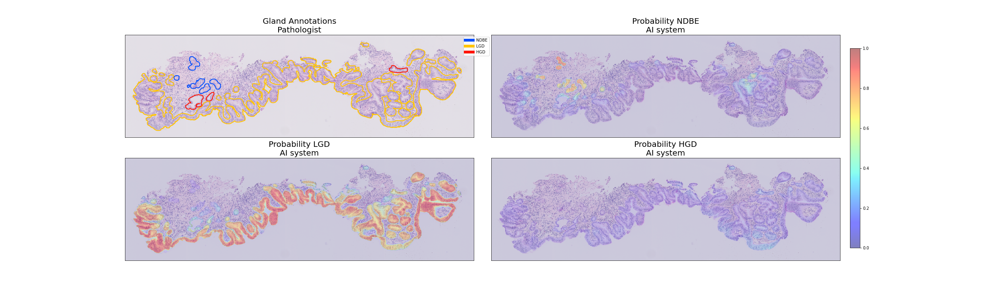

 ## BE expert-level gland grading with Neural Networks
This repository contains code for development of a Neural Network that support pathologists with identifying dysplastic 
areas of interest on H&E tissue samples from patients with Barrett's Esophagus (BE). This work has been published: [full paper link](https://www.modernpathology.org/article/S0893-3952(24)00111-X/fulltext#%20)

### The Task
BE is associated with an increased risk of developing esophageal cancer. Regular check-ups and pathological assessment of biopsy material are crucial for identifying BE patients at risk.
Dysplasia in BE is assessed according to the revised Vienna criteria, which are based on the dysplasia classification in inflammatory bowel disease. Evaluation of cytological and architectural severity and invasion status leads to assignment in
one of the following categories: non-dysplastic Barrett's esophagus (NDBE), indefinite for dysplasia (IND), low grade dysplasia (LGD) and high grade dysplasia (HGD). Description and figure from [[1]](#1).

## Algorithm for grading dysplasia in Barrett's
Overview of the AI system for assessment and grading of BE dysplasia. (a) An input whole-slide image is processed by a dysplasia grading network, based on the U-Net architecture. (b) Subsequently a second network, based on the Set Transformer architecture, takes in confidence scores from highly certain areas of dysplasia for the slide level prediction into the three categories: non-dysplastic, low-grade and high-grade dysplasia. In this example the dysplasia scoring algorithm detected high levels of dysplasia shown by the dark orange and red colored tissue regions.

### (1) Segmentation model for: NDBE vs LGD vs HGD
Implemented as an ensemble of UNet++ models. (`train_segmentation.py, train_ensemble.py`)

Example of a segmented biopsy by the AI system.

### (2) Slide-Level Prediction
Implemented as a SetTransformer (`train_slide_classification.py`), trained for the following task:

   * $\textbf{x}$: set of top 25 suspicious tiles for slide $s$
   * $y$: dysplasia label of slide $s$

For ranking of confidence in containing dysplasia see `confidence_calibration.py`

### Results
We compared the AI system against 55 GI pathologists. Some highlights of the results can be seen below:

Accuracy of the AI system and each of the individual 55 participating pathologists for grading BE-related dysplasia. The plot shows the accuracy (%) of the AI system and each of the individual 55 participating pathologists in terms of agreement (as accuracy) with the consensus reference panel on the Bolero test set (n=55). The AI is indicated by the orange line, GI pathologists are indicated by the grey bars and reference pathologists are highlighted in blue. The black dashed line depicts the median accuracy of the 51 participating GI pathologists (excluding the four reference pathologists). 

An example of a WSI that was accurately diagnosed by the AI system but underdiagnosed by a substantial number of the participating pathologists. In the top-left WSI, the reference diagnosis was LGD with 3 out of 4 reference pathologists agreeing on LGD, and one reference pathologist diagnosing the WSI as NDBE. Among the remaining 51 pathologists, 21 diagnosed NDBE, 14 were IND, 11 diagnosed as LGD, and 5 diagnosed HGD. The AI system accurately diagnosed this WSI as LGD, with probabilities of NDBE: 24%, LGD: 54%, and HGD: 22%. The top-right section displays the biopsy containing dysplasia, accompanied by a heat map showing the AI system's predicted probability of dysplasia. We have highlighted two regions, labeled A and B, to demonstrate the AI system's proficiency in gland segmentation and dysplasia detection.

## References
<a id="1">[1]</a> 
M.J. van der Wel, (2019). 
PhD thesis, Faculty of Medicine (AMC-UvA), December 2019.
